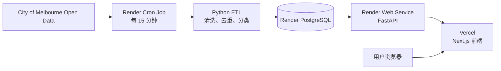

# SensoryWay 云端部署配置方案

这份方案适用于前端部署在 **Vercel**、API / PostgreSQL / ETL 部署在 **Render** 的前后端分离项目。所有密码、数据库 URL 和 API Key 必须仅填入平台环境变量，不能写入 GitHub 仓库、文档或截图。

## 1. 总体架构



| 服务 | 平台 | 职责 |
| --- | --- | --- |
| 前端 | Vercel | 承载 Next.js 页面、地图和路线交互。 |
| 后端 | Render Web Service | 提供 FastAPI REST API，读取 PostgreSQL 并计算路线拥挤度。 |
| 数据库 | Render PostgreSQL | 保存传感器位置、分钟客流、公共交通站点和 ETL 运行日志。 |
| ETL | Render Cron Job | 定时拉取官方开放数据，写入同一个 PostgreSQL 数据库后退出。 |

## 2. 配置前的约定

以下是当前项目使用的生产地址格式；实际项目请替换成自己的域名或服务名：

```text
Frontend URL: https://<your-vercel-project>.vercel.app
Backend URL:  https://<your-render-api>.onrender.com
```

Render 的数据库、Web Service 与 Cron Job 必须放在**同一 Region**。本项目使用 Singapore，因此 Cron Job 可以通过内部网络连接 PostgreSQL。

## 3. Render PostgreSQL

1. 在 Render 创建 PostgreSQL 数据库。
2. 记录数据库的 **Internal Database URL**。
3. 只将这个 URL 配置给同一 Render Region 中的 API Web Service 和 Cron Job。

```text
DATABASE_URL=<Render PostgreSQL Internal Database URL>
```

不要将 External Database URL 用于 Render 内部服务，也不要把任一数据库 URL 提交到 GitHub。

数据库的主要表如下：

| 表 | 用途 |
| --- | --- |
| `sensor_location` | 传感器名称、位置和状态。 |
| `pedestrian_minute_count` | 每个传感器、每一分钟的客流计数与拥挤等级。 |
| `transit_access_point` | CBD 的电车、火车、公交等站点。 |
| `data_refresh_log` | 每次 ETL 的开始时间、结束时间、结果与错误信息。 |

## 4. Render FastAPI Web Service

创建 Docker Web Service，连接仓库的 `main` 分支。

| Render 设置 | 值 |
| --- | --- |
| Runtime | `Docker` |
| Root Directory | 留空（仓库根目录） |
| Dockerfile Path | `backend/Dockerfile.production` |
| Docker Build Context Directory | 留空（仓库根目录） |
| Docker Command | 留空，使用 Dockerfile 默认命令 |
| Health Check Path | `/api/v1/health` |
| Auto-Deploy | `On Commit` |

生产 Dockerfile 的默认命令会先执行数据库 migration，再启动 FastAPI：

```text
python -m scripts.start_api
```

### API 环境变量

| 变量 | 示例 / 说明 |
| --- | --- |
| `DATABASE_URL` | 同一 Render PostgreSQL 的 **Internal Database URL**。 |
| `CORS_ORIGINS` | 前端实际域名，例如 `https://<your-vercel-project>.vercel.app`。多个域名以英文逗号分隔。 |
| `DATA_STALE_AFTER_MINUTES` | `60`。最新官方读数超过 60 分钟时，不再提供拥挤路线推荐。 |
| `CROWD_LOW_MAX` | `10`。 |
| `CROWD_MEDIUM_MAX` | `30`。 |
| `ROUTE_SENSOR_RADIUS_METRES` | `80`。 |
| `ORS_API_KEY` | OpenRouteService 服务端 API Key。 |
| `ORS_TIMEOUT_SECONDS` | `10`。 |
| `ETL_TRIGGER_TOKEN` | 长随机值，仅供手动触发保护接口；不要给前端。 |
| `GEOCODER_SEARCH_URL` | `https://nominatim.openstreetmap.org/search`。 |
| `GEOCODER_TIMEOUT_SECONDS` | `8`。 |
| `GEOCODER_MIN_INTERVAL_SECONDS` | `1`。 |

部署完成后验证：

```text
GET https://<your-render-api>.onrender.com/api/v1/health
```

预期结果：

```json
{"status":"ok","database":"connected"}
```

## 5. Render Cron Job（ETL）

Cron Job 是独立服务，不会自动继承 Web Service 的环境变量。它必须重新设置所需变量，或使用 Render Environment Group 共享非敏感配置。

| Render 设置 | 值 |
| --- | --- |
| Name | 例如 `sensoryway-open-data-etl`，必须与 API 服务不同名。 |
| Runtime | `Docker` |
| Branch | `main` |
| Region | 与 PostgreSQL / API 相同，例如 Singapore。 |
| Root Directory | 留空 |
| Dockerfile Path | `backend/Dockerfile.production` |
| Docker Build Context Directory | 留空 |
| Docker Command | `python -m scripts.ingest_open_data --scope minute` |
| Schedule | `*/15 * * * *`（UTC，每 15 分钟） |
| Instance Type | `Starter` |
| Auto-Deploy | `On Commit` |

### Cron Job 环境变量

```text
DATABASE_URL=<同一个 Render PostgreSQL Internal Database URL>
CITY_TIMEZONE=Australia/Melbourne
CROWD_LOW_MAX=10
CROWD_MEDIUM_MAX=30
MINUTE_LOOKBACK_MINUTES=60
MINUTE_RETENTION_MINUTES=90
REFERENCE_REFRESH_INTERVAL_HOURS=24
ARCHIVE_RAW_RECORDS=false
CITY_OPEN_DATA_API_KEY=<可选；由官方平台发放时才填写>
```

`ARCHIVE_RAW_RECORDS=false` 是正确的云端设置：Cron 容器在任务结束后会销毁，原始 JSON 文件不会可靠保存；清洗后的业务数据和运行日志则存进 PostgreSQL。

创建后在 Cron Job 的 **Runs** 页面点击一次 **Trigger Run**。正常日志应包含：

```text
Open-data minute ingestion completed successfully.
Cron job run finished successfully
```

不要同时启用 GitHub Actions 的 15 分钟 ETL schedule，否则会造成重复抓取并增加上游 HTTP 429 限流风险。本项目的 GitHub workflow 保持为手动恢复用途。

## 6. Vercel Next.js 前端

从同一个 GitHub 仓库导入 Vercel 项目。

| Vercel 设置 | 值 |
| --- | --- |
| Framework Preset | `Next.js` |
| Root Directory | `frontend` |
| Production Branch | `main` |
| Build Command | 默认 `next build` 或项目默认值 |
| Auto-Deploy | 启用 |

### Vercel 环境变量

| 变量 | 示例 / 说明 |
| --- | --- |
| `NEXT_PUBLIC_API_BASE_URL` | `https://<your-render-api>.onrender.com`，没有末尾 `/`。 |
| `NEXT_PUBLIC_GOOGLE_MAPS_API_KEY` | 只允许前端域名使用的 Google Maps 浏览器 key。 |

`NEXT_PUBLIC_*` 变量会在 Next.js 构建时写入浏览器代码。因此，修改 `NEXT_PUBLIC_API_BASE_URL` 或 Google Maps key 后必须重新部署 Vercel，不能只刷新网页。

同时把 Vercel 的生产域名加入 Render API 的 `CORS_ORIGINS`；否则浏览器会因 CORS 拦截请求。

## 7. ETL 数据如何更新与存储

1. Render Cron Job 每 15 分钟启动一个临时容器。
2. 它从 City of Melbourne 读取“过去一小时、按分钟”的客流 JSON export。
3. 首次运行、或参考数据超过 24 小时时，额外更新传感器位置和公共交通站点。
4. ETL 删除无效记录、按 `(location_id, sensing_datetime)` 去重、计算 `low` / `medium` / `high` 拥挤等级。
5. 数据写入 PostgreSQL；重复键使用 upsert 更新，不会产生重复行。
6. 数据库只保留最近 90 分钟的分钟客流，避免表无限增长。
7. 每次执行写入 `data_refresh_log`，状态可能为 `running`、`succeeded`、`failed` 或 `rate_limited`。

系统使用 PostgreSQL advisory lock，避免多个 Cron 或手动任务同时写同一份数据。

## 8. 验证与排错清单

### 服务是否正常

```text
GET /api/v1/health
GET /api/v1/data-status
```

`/api/v1/data-status` 的关键字段：

| 字段 | 正常含义 |
| --- | --- |
| `last_refresh_status` | `succeeded` 表示最近 ETL 成功。 |
| `last_refresh_completed_at` | 最近任务结束时间。 |
| `latest_data_at` | 上游官方数据中最新观测时间。 |
| `age_minutes` | 最新观测距现在的分钟数。 |
| `stale_after_minutes` | 当前硬过期界限，应为 `60`。 |

### 常见现象

| 现象 | 优先检查 |
| --- | --- |
| 前端请求失败或没有路线数据 | Vercel 的 `NEXT_PUBLIC_API_BASE_URL`、Render `CORS_ORIGINS`、API health。 |
| `last_refresh_status: failed` | Render Cron Job 最新日志。 |
| `last_refresh_status: rate_limited` | 上游限流；不要立刻重试，等待下一轮或申请官方 API key。 |
| `succeeded` 但 `latest_data_at` 很旧 | ETL 成功但官方源尚未发布较新的观测；这不是数据库写入失败。 |
| `stale_after_minutes` 仍为 45 | Render Web Service 中现有 `DATA_STALE_AFTER_MINUTES=45` 覆盖了代码默认值；改成 `60` 后 Save and Deploy。 |
| 前端仍访问 `localhost:8000` | Vercel 环境变量未正确设置或尚未重新部署。 |

## 9. 日常发布顺序

```text
本地测试
  → 提交并推送 main
  → 确认 Render Web Service 部署成功
  → 确认 Vercel 前端部署成功
  → 检查 /api/v1/health 与 /api/v1/data-status
  → 查看下一次 Render Cron Job 是否 succeeded
```

涉及数据库表结构时，必须新增 SQL migration；涉及 ETL 命令或环境变量名称时，必须同时检查 Cron Job 的 Docker Command 和 Environment 配置。
